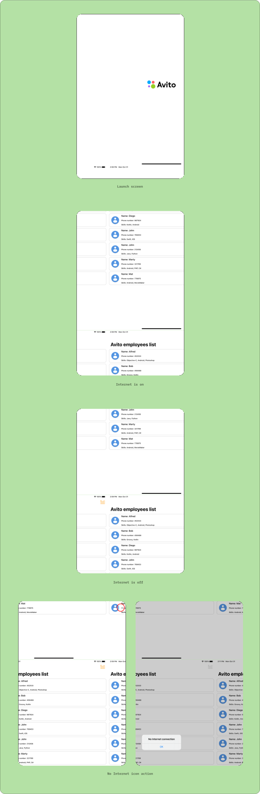

# Тестовое задание на позицию iOS trainee в Авито (2022 г.)

[](https://travis-ci.org/joemccann/dillinger)

## Общее описание задания
Написать приложение для iOS. Приложение должно состоять из одного экрана со списком. Список данных в формате JSON приложение загружает из интернета по [ссылке](https://run.mocky.io/v3/1d1cb4ec-73db-4762-8c4b-0b8aa3cecd4c), необходимо распарсить эти данные и отобразить их в списке. 

## Что было сделано

### Характеристики приложения:
* iOS 13+
* Поддержка iPhone и iPad
* Светлая + тёмная темы
* UICollectionViewDiffableDatasource + CompositionalFlowLayout
* MVP (+ Router)

### Фичи
* Мониторинг подключения к интернету
* Сетевые запросы на URLSession (с использованием async/await)
* Кэширование запроса на 1 час

### Скриншоты
#### - iPhone


#### - iPad


---
<details>
<summary>Требования по выполнению:</summary>

### Требование к реализации:
- Приложение работает на iOS 13 и выше
- Реализована поддержка iPhone и iPad
- Список отсортирован по алфавиту
- Кэширование ответа на 1 час
- Обработаны случаи потери сети / отсутствия соединения

Внешний вид приложения: по возможности, лаконичный, но, в целом, на усмотрение кандидата.

### Требования к коду:
 - Приложение написано на языке Swift
 - Пользовательский интерфейс приложения настроен в InterfaceBuilder (в Storiboard или Xib файлы) или кодом без использования SwiftUI
 - Для отображения списка используется UITableView, либо UICollectionView
 - Для запроса данных используется URLSession

### Требования к передаче результатов:
- Код должен быть выложен в git-репозиторий на [github.com](http://github.com/) и отправлен нам.

</details>

---

<details>
<summary>Пример данных API:</summary>

```json
{
    "company": {
        "name":"Avito",
        "employees": [
            {
                "name": "John",
                "phone_number": "769453",
                "skills": ["Swift", "iOS"]
            }, 
            {
                "name": "Diego",
                "phone_number": "987924",
                "skills": ["Kotlin", "Android"]
            }, 
            {
                "name": "Alfred",
                "phone_number": "452533",
                "skills": ["Objective-C", "Android", "Photoshop"]
            }, 
            {
                "name": "John",
                "phone_number": "212456",
                "skills": ["Java", "Python"]
            }, 
            {
                "name": "Mat",
                "phone_number": "778975",
                "skills": ["Android", "MovieMaker"]
            }, 
            {
                "name": "Bob",
                "phone_number": "456468",
                "skills": ["Groovy", "Kotlin"]
            }, 
            {
                "name": "Marty",
                "phone_number": "321789",
                "skills": ["Android", "PHP", "C#"]
            }
        ]    
    }
}
```

</details>

---
